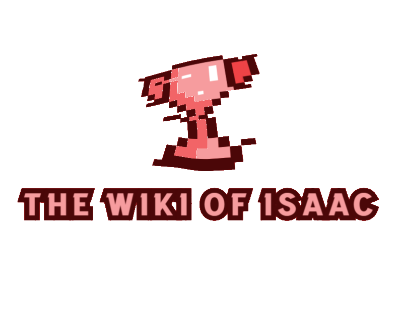

<h1 align="center">
  <br>
  <a href="http://www.amitmerchant.com/electron-markdownify"></a>
  <br>
  The Wiki of Isaac Website React
  <br>
</h1>

<h4 align="center">App for gaming progress on TBOI</h4>

<p align="center">
  <a href="#-key-features">Key Features</a> •
  <a href="#-project-objective">Project objective</a> •
  <a href="#-backend">Backend</a> •
  <a href="#️-stack">Stack</a> •
  <a href="#️-views">Views</a> •
  <a href="#️-future-improvements">Future improvements</a> •
  <a href="#-you-may-also-like">You may also like...</a>
</p>

## 🔑 Key Features

* Application for making consults related with the videogame The Binding of Isaac
* Register for create user, using JWT to generate token and Redux for persistance on the application
* Profile view with your data, able to see your actual progress on the videogame
* Reusable entity view to search information about the main things of the game: characters, items, pickups and achievements
* Single Page Application

## 🎯 Project objective

This website is a project focused on React facilities, concretely on the implementation of Redux, with the main objective to make an application to save your progress in a game online. The main objective of this application is to face off the wiki websites that are not SPA and are not implemented with React Framework, and moreover, to offer the user an experience of progress into the game in a visual way.

## 🔗 Backend

This project is developed based on a [project](https://github.com/CariblaGIT/TWOI-Backend) that I have made for making possible all the consults that are actually done in this application

## ⌨️ Stack
<div align="center">
<a href="https://es.react.dev/">
    
</a>
<a href="https://www.npmjs.com/package/react-router-dom">
    
</a>
<a href="https://www.npmjs.com/">
    
</a>
<a href="https://developer.mozilla.org/es/docs/Web/JavaScript">
    
</a>
<a href="https://jwt.io/">
    
</a>
<a href="https://developer.mozilla.org/es/docs/Web/CSS">
    
</a>
<a href="https://getbootstrap.com/">
    
</a>
<a href="https://railway.app/">
    
</a>
<a href="https://redux.js.org/">
    
</a>
 </div>

 ## 👨‍💻 Installation

Follow the steps to emulate the project in your local device. But is not necessary because the project has been uploaded to AWS, so you can skip the installation and use the following URL to make all the consults in front of your localhost one.
<div align="center">
<a href="https://master.d3vk6brqdjmocl.amplifyapp.com/home/">🚀 App deployed 🚀</a>
</div>

1. Clone repo
2. Install dependencies:
    ```bash
    npm install
    ```
3. Launch the project in your local device:
    ```bash
    npm run dev
    ```
After that, in localhost:PORT, will be launched the application, and you will be on the landing page (Login interface)

## 🖥️ Views

[Click here to watch the demo video with all views](https://youtu.be/86ZuG9Hu8PE)

## 🛠️ Future improvements

⬜ Adding the way to add more marks
<br>
⬜ Adding choice to change avatar on your profile
<br>
⬜ Implement admin panel and interactions
<br>

## 👀 You may also like...

- [Between Sins](https://gitlab.com/daghdha1/betweensins) - RPG videogame 
- [Mars Alienated](https://gitlab.com/AdrianGarciaAndreu/mars-alienated-rv-htc) - VR escape room experience in a space station

<div align="center">
<a href="https://www.linkedin.com/in/carlos-ibañez-lamas-74487b228/" target="_blank"></a>
<a href="https://gitlab.com/CariblaGTI" target="_blank"></a>
</div>

------

<div align="center">
<a href="#-key-features">🔼 Back to top 🔼</a>
</div>